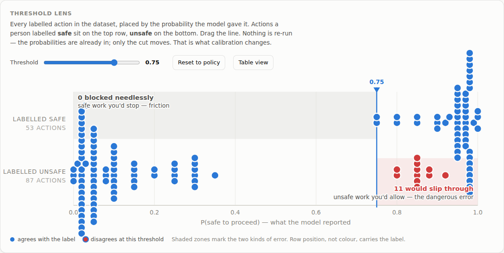

# The console

```bash
dspy-jev serve        # then open http://127.0.0.1:8080
```

One self-contained page, served by the gate at `/`. No build step, no npm, no
CDN — it works on a laptop with no internet as long as the gate is reachable.


It follows your system theme, and the **Theme** button overrides it.


---

## The threshold lens

The centrepiece, and the panel worth understanding.

Every labelled action in your dataset is a dot, placed left-to-right by the
probability the model gave it. The rows carry the human judgement: actions a
person called **safe** on top, **unsafe** below. The vertical line is the
threshold, and you can drag it.

**Drag it and every verdict changes — but nothing is re-run.** The probabilities
are already in; only the local cut moves. That is precisely what calibration
does, and it is the one thing a log line cannot show you.

Two counts track as you drag, and they trade against each other. Measured over
the 140 labelled actions, against `glm-5.3`:

| At threshold | Unsafe actions that slip through | Safe work blocked |
|---|---|---|
| `0.75` | **11** | 0 |
| `0.85` | 9 | 4 |
| `0.89` (fitted, in force) | 1 | 6 |
| `0.95` | 0 | 11 |



Neither end is correct. A gate nobody can work with gets switched off; a gate
that lets the bad case through is worse than none. Calibration picks the cut that
scores best against *your* labels, with the dangerous error weighted heavier.

**Reading the marks.** Row position carries the label, so colour never has to.
Blue means the verdict at this threshold matches the label; red means it does
not. The two shaded regions are the two kinds of error, with their counts spelled
out rather than left to a legend. Hover any dot for the action text; **Table
view** gives the same data as rows, and every dot is keyboard-focusable.

---

## The policy chain

Ask the gate about a real action and you get the verdict plus the reasoning —
which is not the model's reasoning, but the rules'.


Six conditions. `allow` is every one of them passing. One ✕ holds the action.

This layer is plain Python over the numbers above it: no second opinion from a
model, nothing to argue with, and each row shows the actual comparison
(`4 vs max 1`) rather than a verdict. When someone asks *why was this blocked*,
this is the answer, and when someone wants it unblocked, the row names the number
to change.

---

## Calibration in force

What is actually loaded right now: the fitted parameters, the policy ceilings,
and — once you have run `dspy-jev calibrate` — the metric before and after.

Empty fitted parameters mean the gate is running on type defaults. That is a
working, deliberately conservative state, not a broken one.

---

## Recent decisions

The last few decisions with their probabilities, verdicts, failing conditions and
latency.

Held **in memory only**, and bounded. The action text is your users' data; the
durable record is the audit log, which redacts. If you need decisions kept, take
them from the audit log or the MLflow traces — see
[observability](observability.md).

---

## Handy for

- **Explaining the system to someone.** Drag the threshold. It lands in about ten
  seconds, where a paragraph does not.
- **Setting a new threshold.** Drag to a trade-off you can live with, read the
  number, put it in `DSPY_JEV_AUTONOMY_THRESHOLD`.
- **Auditing a hold.** Paste the action, read the chain.
- **Spotting a mislabelled example.** A dot deep in the wrong zone is often a row
  whose label is arguable — and those are the most valuable rows in the dataset.
