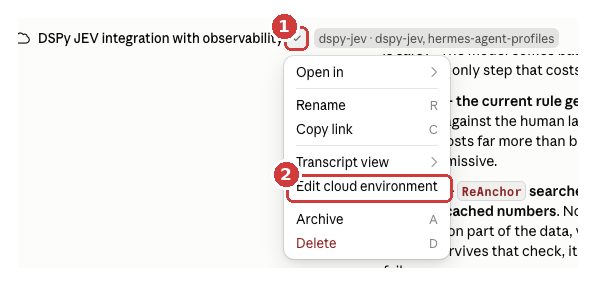
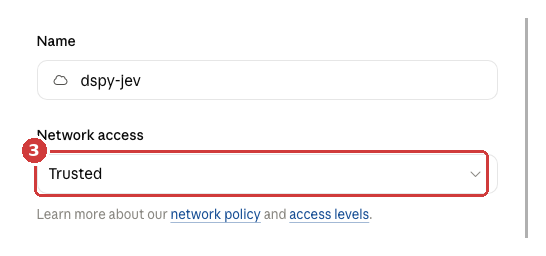
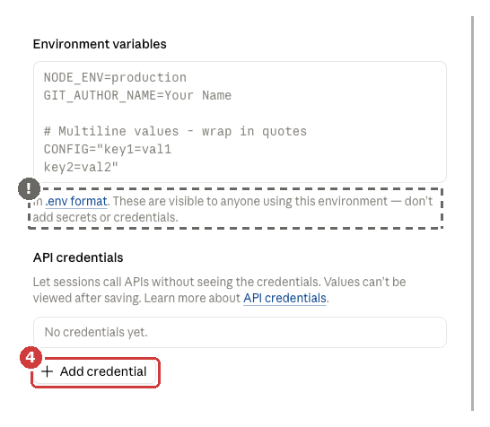
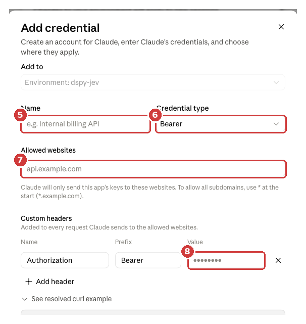

# Setup

Two paths through this page. Both end at the same place.

- **New to this?** Read it top to bottom. Every step says what you are doing and
  how to tell it worked.
- **Done this before?** [Jump to the short version](#the-short-version).

---

## What you are setting up

A small web service that answers one question: *should an agent be allowed to do
this?* It gives back a probability and a verdict.

Three pieces, in dependency order:

| Piece | What it is |
|---|---|
| **A model** | Does the judging. An open-weight model on Ollama Cloud. Nothing is downloaded and no GPU is needed. |
| **The gate** | A Python service wrapping that model, plus the rules that turn its probability into a yes or no. |
| **The console** | A web page served by the gate, so you can see what it is doing. |

You need one credential: an Ollama Cloud API key.

---

## Step 1 — Get an Ollama Cloud key

Go to **[ollama.com/settings/keys](https://ollama.com/settings/keys)**, sign in,
create a key, and copy it. It looks like a long random string.

Leave the tab open — you will paste it in Step 4, and Ollama only shows it once.

> **Do not paste the key into a chat with Claude, or into any file you commit.**
> A key in a transcript or a git history is a key you have to rotate.

---

## Steps 2–4 — Claude Code on the web

Skip to [Step 5](#step-5--install) if you are running on your own machine; there
you just `export OLLAMA_API_KEY=...` and carry on.

In a cloud session, two things must be true: the session has to be **allowed to
reach ollama.com**, and it has to be able to **authenticate** to it. They are
separate settings and both are easy to miss.

### Step 2 — Open the environment editor

Click the **⌄** beside the session name in the title bar, then **Edit cloud
environment**.



1. The chevron beside the session name.
2. **Edit cloud environment**.

### Step 3 — Let the session reach ollama.com

This is the step people skip, and the failure is confusing when they do: the key
is correct, and every request still fails.



3. Set **Network access** so that `ollama.com` is reachable — either a broader
   access level, or by adding `ollama.com` to the allowed domains. The **network
   policy** and **access levels** links beside the field explain the levels.

**How you will know it is wrong:** requests fail with

```
proxy refused CONNECT to ollama.com:443: 403 Forbidden
```

That is the network policy, not your key. No amount of fixing the key helps.

### Step 4 — Add the key as an API credential

Scroll down in the same dialog. You will see two boxes. Use the second one.



**!** **Not** *Environment variables*. That box says it outright: its contents are
visible to anyone using the environment. It is for `NODE_ENV=production`, not for
secrets.

4. Click **Add credential**.



5. **Name** — anything you will recognise later. `Ollama Cloud` is fine.
6. **Credential type** — leave it on **Bearer**.
7. **Allowed websites** — `ollama.com`. The key is only ever sent here.
8. **Value** (under Custom headers, beside `Authorization` / `Bearer`) — paste
   your key. Leave Name as `Authorization` and Prefix as `Bearer`.

Click **Connect**, then **Save** the environment.

**The session never sees the key.** It is attached to outgoing requests on the way
out. That is why the gate has a second authentication mode — see
[Which auth mode am I in?](#which-auth-mode-am-i-in) below.

> **Changes apply to new sessions.** The session you are in now will not pick
> them up. Start a fresh one.

---

## Step 5 — Install

```bash
git clone https://github.com/techcwbldr26/dspy-jev && cd dspy-jev
./scripts/setup_pi.sh          # or setup_hermes_agent.sh / setup_claude_code.sh
source .venv/bin/activate
```

The script builds a virtual environment, installs the project, writes a `.env`,
and runs a health check. Which one you pick only changes defaults — you can
switch later with `DSPY_JEV_HARNESS`.

---

## Step 6 — Prove it works

```bash
dspy-jev doctor --probe
```

`doctor` checks the paperwork; `--probe` sends one tiny real request and reports
whether the provider actually accepted it. That is the difference between a key
that *looks* right and one that *is* right.

Expected, when everything is in place:

```json
{
  "checks": [
    { "check": "auth.mode",       "ok": true, "detail": "platform-injected Authorization header (no key in this process)" },
    { "check": "credentials",     "ok": true },
    { "check": "ollama.reachable","ok": true, "detail": "17 cloud models listed" },
    { "check": "provider.probe",  "ok": true, "detail": "openai/glm-5.3-flash answered" }
  ],
  "ok": true
}
```

### When it fails

| `detail` contains | What is actually wrong | Fix |
|---|---|---|
| `proxy refused CONNECT to ollama.com:443: 403` | Network policy, not your key | Step 3 |
| `401`, `Unauthorized`, `invalid_api_key` | The credential was rejected | Step 4 — check the key and that Allowed websites is `ollama.com` |
| `404` | The model name is not served any more | `dspy-jev models --live`, then set `DSPY_JEV_DECISION_MODEL` |
| `set OLLAMA_API_KEY … or DSPY_JEV_AUTH_MODE=proxy` | The gate found no credential at all | See below |

### Which auth mode am I in?

Two ways to authenticate, and the gate needs to know which:

| Mode | When | Set |
|---|---|---|
| `key` *(default)* | You have `OLLAMA_API_KEY` in the environment — your own machine, CI, a container you control | nothing |
| `proxy` | The platform injects the `Authorization` header and never shows you the key — Claude Code's **API credentials** | `DSPY_JEV_AUTH_MODE=proxy` |

In `proxy` mode the gate sends an inert placeholder as the API key and lets the
platform replace the header. If that placeholder ever reached a provider
unchanged, the request fails loudly rather than succeeding oddly.

`dspy-jev doctor` prints the active mode on the `auth.mode` line.

---

## Step 7 — Calibrate

```bash
dspy-jev calibrate --dataset data/action_gate.jsonl
```

What this does, precisely:

1. Sends each of the 40 labelled example actions to the model and asks *how
   likely* each is to be safe. The answers are cached.
2. Scores the current rule against the human labels, weighted so that letting an
   unsafe action through costs more than blocking a safe one.
3. Searches for a threshold that scores better, **re-using the cached answers** —
   so this part costs nothing and is fast. Candidates must also survive a fold
   check, so the result is not just memorised.

The output is a file of numbers:

```json
{ "safe_to_proceed": { "threshold": 0.71 }, "risk": { "cuts": [0.4, 1.3, 2.2, 3.1] } }
```

No prompt is rewritten and no model is trained. Cost: about 40 requests, once.

If the report says nothing beat the defaults, that is a real result, not a
failure — the defaults were already right for this data.

---

## Step 8 — Look at it

```bash
dspy-jev serve         # then open http://127.0.0.1:8080
```

See [the console](console.md) for what each panel is showing you.

---

## The short version

```bash
# Cloud session: allow ollama.com in Network access, then add the key under
# API credentials (Bearer / ollama.com / Authorization), and start a NEW session.
export DSPY_JEV_AUTH_MODE=proxy       # omit if you hold OLLAMA_API_KEY yourself

./scripts/setup_pi.sh && source .venv/bin/activate
dspy-jev doctor --probe               # must end "ok": true
dspy-jev calibrate --dataset data/action_gate.jsonl
dspy-jev serve                        # http://127.0.0.1:8080
```

---

## Where things live

| Path | What |
|---|---|
| `.env` | Generated by the setup script. Gitignored. Never commit it. |
| `artifacts/action_gate.<harness>.json` | The fitted thresholds |
| `artifacts/action_gate.<harness>.report.json` | Before/after scores |
| `data/action_gate.jsonl` | The labelled examples. Replace with your own. |

## Cost and privacy, plainly

- Calibration is about 40 requests, once. Re-running is free while the cache is warm.
- Each live decision is one request.
- Action text goes to Ollama Cloud, which states it does not train on it. Read
  their [privacy policy](https://ollama.com/privacy) and decide for yourself.
- The gate logs the probability evidence, not the prompt bodies, unless you set
  `DSPY_JEV_AUDIT_PAYLOADS=true`.
